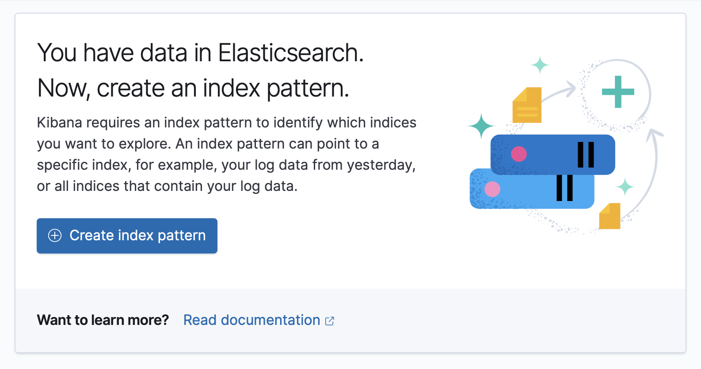
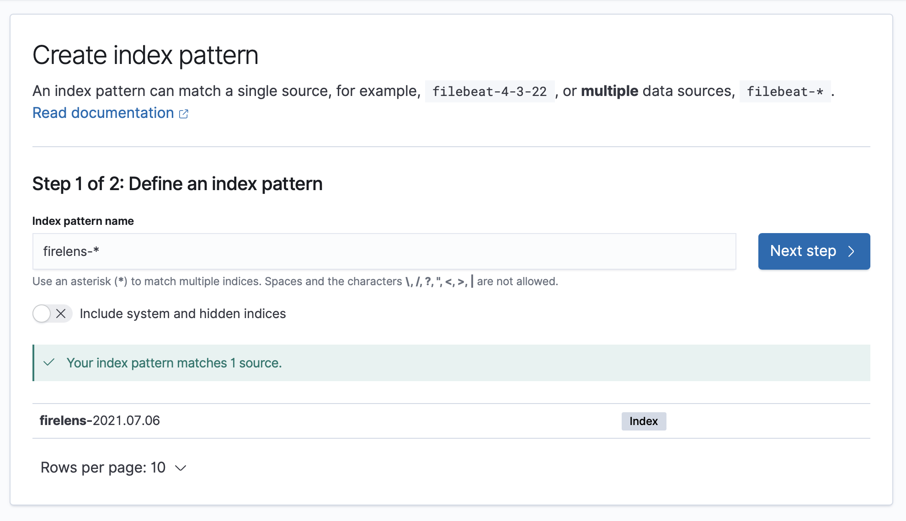
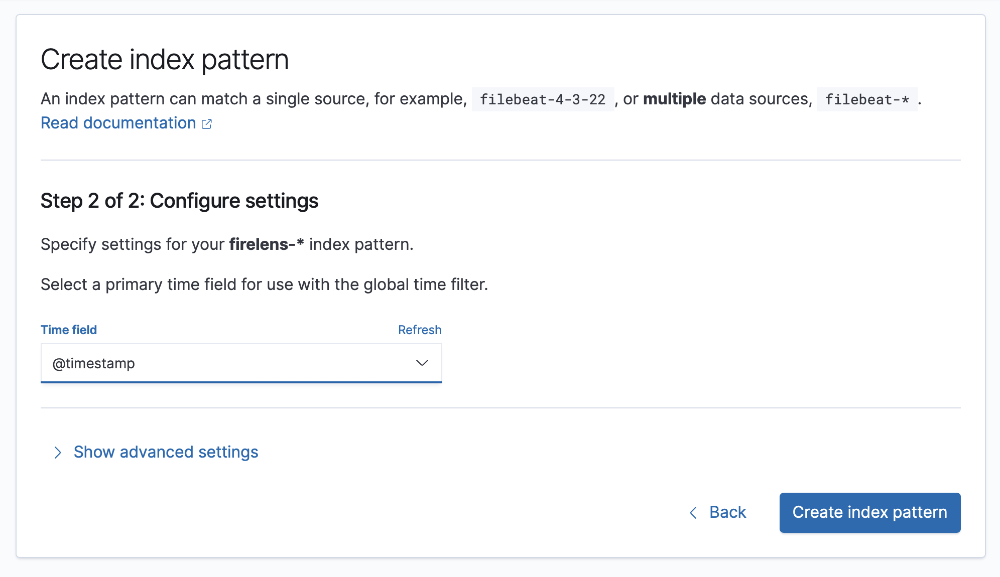
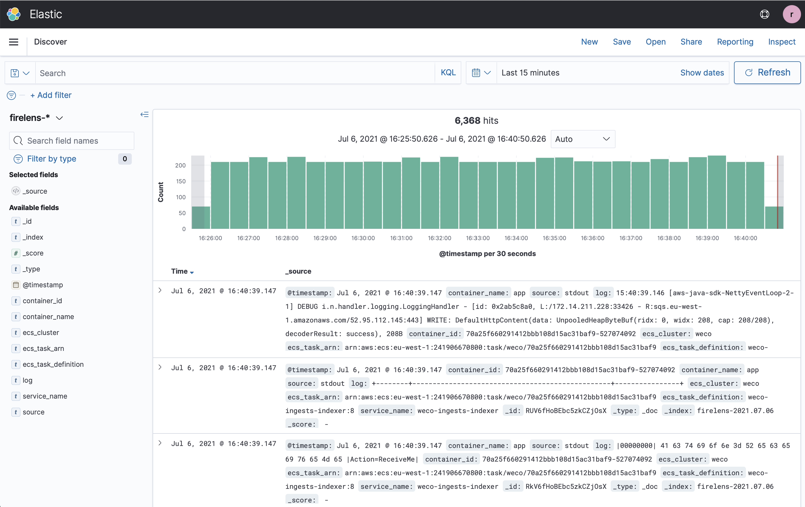

# Logging in the Terraform demo

Application logs are written to an Amazon Elasticsearch cluster.
You can only see application logs after you have [created your demo resources](../README.md#creating-the-demo).

To see the logs:

1.  Retrieve your Elasticsearch username and password from Secrets Manager:

    ```
    aws secretsmanager get-secret-value --secret-id elasticsearch/user
    aws secretsmanager get-secret-value --secret-id elasticsearch/password
    ```

2.  Get the URL to your logging cluster:

    ```console
    $ terraform output kibana_endpoint
      "search-weco-storage-prototype-abcdefghijklmnopqrstuvwxyz.eu-west-1.es.amazonaws.com/_plugin/kibana/"
    ```

3.  Take the URL from step 2, prepend `https://` and add `app/management/kibana/indexPatterns`, e.g.

    ```
    https://search-weco-storage-prototype-abcdefghijklmnopqrstuvwxyz.eu-west-1.es.amazonaws.com/_plugin/kibana/app/management/kibana/indexPatterns
    ```

    Open this URL, using the username and password from step 1.

4.  This takes you to the index patterns in Kibana.

    If there is already a `firelens-*` index pattern configured, skip to step 7.

    If there are no index patterns yet, click the blue button "Click index pattern".

    

5.  Type `firelens-*` as the name of your index pattern, then click "Next step".

    

6.  Select `@timestamp` as the time field for your index pattern, then click "Create index pattern".

    

7.  Click the hamburger menu (three horizontal lines) in the top left-hand corner, and select the Discover view. This allows you to browse your application logs.

    
