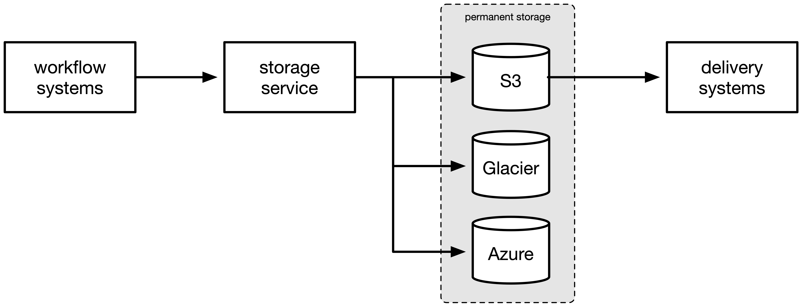

# Storage service

<!--
  Note: this introductory information is copied from the repo's README,
  and they should be kept in sync.
-->

The storage service manages the storage of our digital collections, including:

*   Uploading files to cloud storage providers like Amazon S3 and Azure Blob
*   Verifying fixity information on our files (checksums, sizes, filenames)
*   Reporting on the contents of our digital archive through machine-readable APIs and search tools

## Requirements

The storage service is designed to:

-   Ensure the safe, long-term (i.e. decades) storage of our digital assets
-   Provide a scalable mechanism for identifying, retrieving, and storing content
-   To support bulk processing of content, e.g. for file format migrations or batch analysis
-   Follow industry best-practices around file integrity and audit trails
-   Enable us to meet [NDSA Level 4][ndsa] for both digitised and ["born-digital"][born_digital] assets

[ndsa]: https://ndsa.org/activities/levels-of-digital-preservation/
[born_digital]: https://en.wikipedia.org/wiki/Born-digital

## High-level design

This is the basic architecture:

Workflow systems (Goobi, Archivematica) create "bags", which are collections of files stored in the BagIt packaging format.
They upload these bags to a temporary S3 bucket, and call the storage service APIs to ask it to store the bags permanently.

The storage service reads the bags, verifies their contents, and replicates the bags to our permanent storage (S3 buckets/Azure containers).
It is the only thing which writes to our permanent storage; this ensures everything is stored and labelled consistently.

Delivery systems (e.g. DLCS) can then read objects back out of permanent storage, to provide access to users.

## Documentation

This GitBook space includes:

*   How-to guides explaining how to do common operations, e.g. upload new files into the storage service
*   Reference material explaining how the storage service is designed, and why we made those choices
*   Notes for Wellcome developers who need to administer or debug our storage service deployment

## Repo

All our storage service code is in <https://github.com/wellcomecollection/storage-service>

The READMEs in the repo have instructions for specific procedures, e.g. how to create new Docker images.
This GitBook is meant to be a bit higher-level.

---

The unit of storage in the storage service is a **bag**.
This is a collection of files packaged together with [the BagIt packaging format][bagit], which are ingested and stored together.

An **ingest** is a record of some processing on a bag, such as creating a new bag or adding a new version of a bag.

Each bag is identified with a **space** (a broad category) an **external identifier** (a specific identifier) and a **version**.
[Read more about identifiers](explanations/identifiers.md).

[bagit]: https://datatracker.ietf.org/doc/html/rfc8493

## Getting started: use Terraform and AWS to run the storage service

We have [a Terraform configuration](../demo/terraform) that spins up an instance of the storage service.
You can use this to try the storage service in your own AWS account.

## How-to

Once you have a running instance of the storage service, you can use it to store bags.
These guides walk you through some basic operations:

-   [Ingest a bag into the storage service](howto/ingest-a-bag.md)
-   [Look up an already-stored bag in the storage service](howto/look-up-a-bag.md)
-   [Look up the versions of a bag in the storage service](howto/look-up-versions-of-a-bag.md)

You can read the [API reference](developers/api-reference.md) for more detailed information about how to use the storage service.

Once you're comfortable storing individual bags, you can read about more advanced topics:

-   [Storing multiple versions of the same bag]
-   [Sending a partial update to a bag]
-   [Storing preservation and access copies in different storage classes]
-   [Reporting on the contents of the storage service]
-   [Getting callback notifications from the storage service]
-   [Getting notifications of newly stored bags](howto/get-notifications-of-stored-bags.md)

and some information about what to do when things go wrong:

-   [Why ingests fail: understanding ingest errors]
-   [Operational monitoring of the storage service]
-   [Manually marking ingests as failed](howto/manually-marking-ingests-as-failed.md)

## Reference

These topics explain how the storage service work, and why it's designed in the way it is:

-   [The semantics of bags, ingests and ingest types](explanations/ingest-type.md)
-   [Detailed architecture: what do the different services do?]
-   [How identifiers work in the storage service](explanations/identifiers.md)
-   [How files are laid out in the underlying storage](explanations/file-layout.md)
-   [How bags are verified]
-   [How bags are versioned]
-   [Compressed vs uncompressed bags, and the choice of tar.gz](explanations/compression-formats.md)

We also have the [storage service RFC](https://github.com/wellcomecollection/docs/tree/main/rfcs/002-archival_storage), the original design document -- although this isn't actively updated, and some of the details have changed in the implementation.

## Developer information

These topics are useful for a developer looking to modify or extend the storage service.

-   [An API reference for the user-facing storage service APIs](developers/api-reference.md)
-   [Key technologies](developers/key-technologies.md)
-   [Adding support for another replica location (e.g. Google Cloud)]
-   [Inter-app messaging with SQS and SNS](developers/inter-app-messaging.md)
-   [How requests are routed from the API to app containers](explanations/how-requests-are-routed.md)
-   [Locking around operations in S3 and Azure Blob]

Developer workflow:

-   [Repository layout](developers/repository-layout.md)
-   [How Docker images are published to ECR](developers/ecr-publishing.md)

## Wellcome-specific information

These topics contain information about the Wellcome instance of the storage service, and may be of less relevance to non-Wellcome readers.

-   [Why did my callback to Goobi timeout?]
