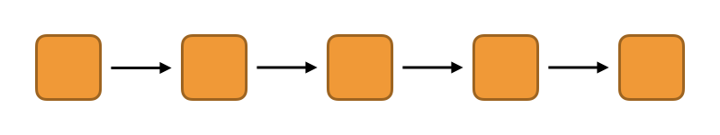
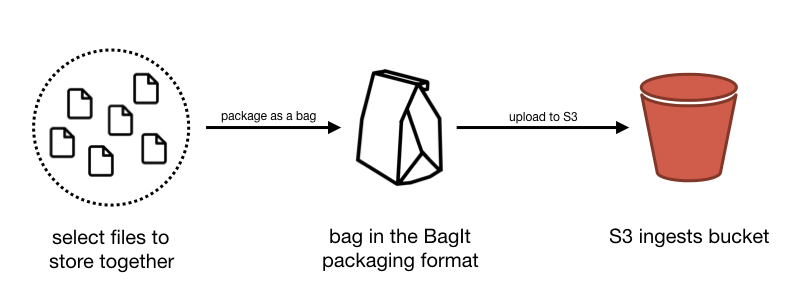
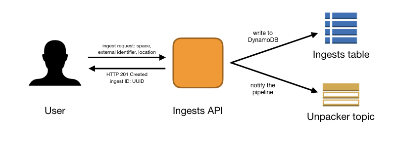
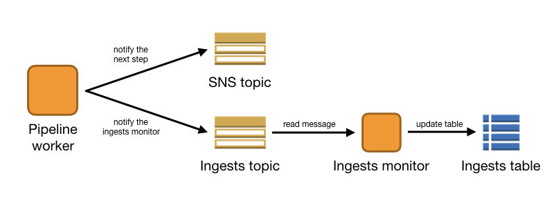

# Architecture of the storage service

**Last updated: 16 March 2020.**

This document explains how the storage service works, at an individual application level.
It is intended for developers who are actively working on the storage service.

It follows the lifecycle of a bag: from initial conception to successfully stored.



At a high level, the storage service is a pipeline.
A message arrives at the first app asking the service to store a bag.
Each app does a small bit of work, then sends a message to the next app, which does another bit of work, and so on until the bag is successfully stored.

In our case, the messaging layer is Amazon SNS/SQS, but the principles apply to any messaging system.

In brief:

*   The user creates and uploads a bag as a tar.gz
*   They trigger an ingest through the **ingests API**
*   The **bag unpacker** unpacks the tar.gz into a temporary bucket
*   The **bag root finder** finds the root of the unpacked bag
*   The **bag verifier** runs a series of checks over the bag, to ensure it's a valid BagIt bag


## Creating and uploading the bag



The user selects files they want to store together, and creates a bag using the [BagIt packaging format](https://tools.ietf.org/html/rfc8493).
They compress the bag as a tar.gz archive, and upload it to an S3 bucket (the "ingests bucket").

<details>
  <summary>Who is "the user"?</summary>

  The user could be a person, but at Wellcome it's more likely to be an automated workflow management tool like Goobi or Archivematica.
</details>


## Triggering a new ingest



An *ingest* is a request to the storage service for it to store a bag.

To trigger an ingest, the user calls the ingests API, passing several parameters:

*   The space and external identifier (part of the bag identifier)
*   The location of the bag in the S3 ingests bucket

The ingests API returns an HTTP 201 Created response, and the *ingest ID*.
The user can use the ingest ID to track the process of an ingest through the storage service.

In the turn, the ingests API records the ingest in two places:

*   It writes the ingest to the *ingests table*, a DynamoDB table that records the state of every ingest
*   It notifies the pipeline by sending a message to an SNS topic (specifically, an SNS topic that is read by the bag unpacker)


## Interlude: tracking the state of ingests

The user can use the ingest ID to ask the ingests API for the state of an ingest.
But how do we track the state of an ingest through the pipeline?



Each app in the pipeline can send messages to two SNS topics:

*   Messages for the ingests monitor (*"I've done this piece of work on the bag"* or *"Something went wrong and I couldn't process the bag"*)
*   Messages for the next app in the pipeline (*"I've finished working with this bag, it's your turn to do something"*).

The ingests monitor is another app which sits outside the pipeline.
It reads messages from the ingests topic/queue, and writes the updates into the ingests table.
When the user asks the ingests API for the state of an ingest, it reads the ingest from this table.


## Unpacking the compressed bag

The first app in the pipeline is the **bag unpacker**.
The user uploads a bag as a compressed tar.gz archive.
This app unpacks the contents of that archive into a temporary bucket, then sends the location of the unpacked bag to the next app.

<details>
  <summary>Why do we unpack into a temporary bucket, not permanent storage?</summary>

  At this point, we don't know what the tar.gz contains.
  It could be missing files, have incorrect checksums, or not be a bag at all!
  The permanent storage should only be for verified, known-good bags.
  We don't want to pollute it with bags that we'll reject later.

  Also, copying the bag into storage we control means the user can't modify it midway through the process.
  It would be an issue if, say, we verified a bag, and then the user uploaded a new version before we'd copied it into the permanent storage.
</details>

<details>
  <summary>Why do we require tar.gz as the compression format?</summary>

  Early versions of the storage service used zip as the compression format, but you can't unpack a zip archive unless you have random access into the archive.
  That means you either download the whole archive to disk (impractical) or implement random access into S3 objects using Ranged GET requests (fiddly).

  Using tar.gz allows you to stream the bytes out, and unpack as you go.
</details>

<details>
  <summary>Do bags need to be compressed at all?</summary>

  Compressing/uncompressing a bag does add some overhead.
  In theory, the storage service could take an uncompressed bag as input, but we'd still want to copy it into storage we control before running an initial verification, so the user doesn't modify it mid-ingest.
</details>


## Finding the root of the unpacked bag

The top level files in a bag are:

*   The metadata files (`bagit.txt`, `bag-info.txt`, the manifests and tag manifests)
*   The payload directory (`data/`)

Depending on how the user compressed the bag as a tar.gz, these entries might be at the top-level, or they might be in an enclosing folder.
The **bag root finder** tries to find the actual root of the bag, and sends that location to the next app.


## Verifying the bag

At this point, we have the root of an unpacked bag.
The **bag verifier** runs a number of checks to ensure this is a valid bag, including:

*   Do the checksums in the manifests match the files in the bag?
*   Does the bag contain any extra files which aren't listed in a manifest?
*   Does the External-Identifier in `bag-info.txt` match the external identifier given to the ingests API?
*   Is there a `fetch.txt`?
    If so, does it refer to any remote resources that might go away?
    Does it only refer to files in previous versions of the bag?
    Do the sizes listed in the `fetch.txt` (if any) match the sizes of the remote objects?

We will likely add more checks over time.

If the bag passes all of these checks, then it's okay to copy to the permanent storage.
The bag verifier sends the location of the verified bag to the next app.

Note: at time of writing, the bag verifier only looks at the SHA-256 manifests.


## Assigning a version to the bag

Now we know we want to store the bag, we need to know where we're going to store it.
The path to a bag in the bucket is

```
/:space/:externalIdentifier/:version
```

where the version is monotonically increasing, e.g. `v1`, `v2`, `v3`.

The **bag versioner** picks a version for the bag based on its (space, external identifier).
It then sends the location of the bag and its version to the next app.

<details>
  <summary>Why assign a version here?</summary>

  We don't assign a version until *after* a bag has been verified.
  This means we're more likely to have a clean set of versions in the permanent storage, because we're only assigning versions for known-good bags.

  If we assigned a version as soon as the user started an ingest, we could:

  -   Assign v1 for the first bag, which stores successfully
  -   Assign v2 for the second bag, which turns out to have incorrect checksums and doesn't get stored
  -   Assign v3 for the third bag, which stores successfully

  If you looked in the permanent storage, you'd see v1 and v3, and it wouldn't be clear what had happened to v2.
  Did it never exist, or did it get deleted?
  Only assigning versions to known-good bags makes this less likely.
</details>


## Replicating and verifying the bag into permanent storage

The **bag replicator** copies a bag from the temporary storage to the permanent storage.
Each replicator writes to exactly one location; at time of writing we have two replicas writing to two S3 buckets:

*   One replicator writes to `wellcomecollection-storage`, a warm replica.
    This bucket that uses Standard-IA storage.
*   One replicator writes to `wellcomecollection-storage-replica-ireland`, a cold replica.
    Objects in this bucket get lifecycled to Glacier Deep Archive after 90 days.

When a replicator finishes, it sends a notification to an instance of the **bag verifier**, which re-runs the previous checks.
This is to detect any corruption or errors introduced by the replicator.
(At time of writing, we've replicated ~500M objects and never seen an error introduced by the replicator.
Nonetheless, the cost of an extra verification is minimal, and knowing that everything in permanent storage has been verified is reassuring.)

The verifier then sends a notification of the completed, verified replica to the next app.


## Aggregating the bag replicas

The **replica aggregator** counts successful replicas of a bag.
Currently we need *two* replicas before we consider a bag stored successfully.

It tracks the replicas in a DynamoDB table, and only sends a message to the next app when it's counted enough replicas.


## Registering the bag

When we have enough replicas, the **bag register** reads the bag one last time to construct the *storage manifest*.
This is a JSON representation of a bag that includes:

*   A list of every file, its checksum and size
*   The replica locations of the bag
*   The date the bag was stored

The storage manifest can be retrieved using the **bags API**.

The bag register sends a notification to an SNS topic to say "this bag was successfully stored"; other apps can tap that event stream to get a list of new bags.


## Optional: making a callback to the user

When the user requests a new ingest, they can supply a *callback URL*.
This is a URL that the storage service can make a request to when a bag finishes processing (successfully or otherwise).
This means the user is immediately notified of the result, rather than having to poll the ingests API.

When the ingests monitor learns that a bag has finished processing, it sends a message to the **notifier**.
The notifier is responsible for actually fulfilling the callback; for making a GET request to the callback URL.
