# API reference

The storage service provides three APIs:

-   The [**create ingest** API](#create-ingest-api) is a request to store a new bag in the storage service
-   The [**get ingest** API](#get-ingest-api) lets you track the progress of a bag through the storage service, until it's successfully stored or fails to store
-   The [**get bag** API](#get-bag-api) lets you retrieve a storage manifest that describes the contents of a successfully-stored bag
-   The **get bag versions** API lets you see all the versions of an external identifier stored in a given space

The storage service does not provide an API for retrieving the content of stored bags -- instead, you should retrieve content [directly from the underlying storage provider](#get-stored-content-api).


## Create ingest API

After you upload a gzip-tar-compressed bag to S3, you call the "Create Ingest" API to ask the storage service to store the bag.
This is a POST request, passing the JSON-formatted ingest in the request body.

Request:

```http
POST /ingests
Content-Type: application/json
{
  "space": {
    "id": "{space}",
    "type": "Space"
  },
  "bag": {
    "type": "Bag",
    "info": {
      "externalIdentifier": "{externalIdentifier}",
      "type": "BagInfo"
    }
  },
  "ingestType": {
    "id": "{ingestType}",
    "type": "IngestType"
  },
  "sourceLocation": {
    "bucket": "{uploadedTarGzS3Bucket}",
    "path": "{uploadedTarGzS3Key}",
    "provider": {
      "type": "Provider",
      "id": "amazon-s3"
    },
    "type": "Location"
  },
  "callback": {
    "url": "{callbackUrl}",
    "type": "Callback"
  },
  "type": "Ingest"
}
```

Parameters:

-   `{space}` -- the broad category of the bag, say `digitised` or `born-digital`.
    See the [explanation of identifiers](../explanations/identifiers.md).
-   `{externalIdentifier}` -- the identifier of the bag within this space.
    This must match the External-Identifier in the `bag-info.txt` file.
-   `{ingestType}` -- if this is the first bag with this external identifier in this space, use `create`.
    Otherwise, use `update`.
-   `{uploadedTarGzS3Bucket}` and `{uploadedTarGzS3Key}` -- the bucket and key where you uploaded the gzip-compressed bag.
-   `{callbackUrl}` -- the URL you want the storage service to send a callback to when the ingest completes.
    If there's no callback, omit the `"callback"` object.

Response:

```http
201 CREATED
Location: /ingests/{id}
```

Parameters:

-   The `Location` header returns you a URL you can use for the [Get Ingests API](#get-ingest-api).


## Get ingest API

Once an ingest has been created, you can use the "Get Ingest" API to track the progress of an ingest through the storage service.
It tells you as a bag moves through the various processing steps, and whether it was successfully stored or rejected by the storage service.

Request:

```http
GET /ingests/{id}
```

Response:

```http
200 OK
{
  "id": "{ingestId}",
  "space": {
    "id": "{space}",
    "type": "Space"
  },
  "bag": {
    "type": "Bag",
    "info": {
      "externalIdentifier": "{externalIdentifier}",
      "type": "BagInfo"
    },
    "version": "{version}"
  },
  "ingestType": {
    "id": "{ingestType}",
    "type": "IngestType"
  },
  "sourceLocation": {
    "bucket": "{uploadedTarGzS3Bucket}",
    "path": "{uploadedTarGzS3Key}",
    "provider": {
      "type": "Provider",
      "id": "amazon-s3"
    },
    "type": "Location"
  },
  "callback": {
    "url": "{callbackUrl}",
    "status": {
      "id": "pending|failed|succeeded",
      "type": "Status"
    },
    "type": "Callback"
  },
  "status": {
    "id": "accepted|processing|failed|succeeded",
    "type": "Status"
  },
  "events": [
    {
      "type": "IngestEvent",
      "createdDate": "{createdDate}",
      "description": "{description}"
    }
  ],
  "createdDate": "{createdDate}",
  "lastModifiedDate": "{lastModifiedDate}",
  "type": "Ingest"
}
```

Some of these fields are repeating values from the "create ingest" API.
The following fields are added by the storage service as it processes the ingest:

-   `{id}` -- the ID of the ingest.
    This is a UUID.

-   `{version}` -- the version of the bag with this external identifier in the space, if assigned.
    This will be a string like `v1`, `v2`, `v3`, and so on.

-   Callback status -- the status of the callback, if the storage service has been asked to send one after the ingest completes.

    

-   Status -- the status of the ingest.
    The ingest starts as `accepted`, and moves into `processing` when the bag is picked up by the storage service.

    

-   Events -- each ingest event describes a processing step in the storage service.
    The timestamps are UTC, and the descriptions are a single sentence explaining the start/finish of a processing step.
    Examples (each line is a separate event):

    > Unpacking started <br/>
    > Unpacking succeeded - Unpacked 168 KB from 9 files <br/>
    > Detecting bag root started <br/>
    > Detecting bag root succeeded <br/>
    > Verification (pre-replicating to archive storage) started

    These events are meant to be human readable, and help a user understand where their bag is in the process.
    They're meant to be suitable for display in a dashboard or workflow tool.

    If the bag can't be ingested correctly, the events should explain why, for example:

    > Unpacking started
    > Unpacking failed - Error reading s3://bucket/b12345678.tar.gz: either it doesn't exist, or the unpacker doesn't have permission to read it


## Get bag API

This API lets you retrieve a storage manifest, which describes the contents of a successfully stored bag.

Request:

```http
GET /bags/{spaceId}/{externalIdentifier}[?version={version}]
```

By default this API returns the latest version of a bag, but you can retrieve a specific version by passing the `version` query parameter.

Example response:

```http
200 OK
{
  "createdDate": "2019-09-13T18:39:43.623658Z",
  "id": "digitised/b24923333",
  "info": {
    "baggingDate": "2019-08-15",
    "externalDescription": "Consultations de medicine",
    "externalIdentifier": "b24923333",
    "payloadOxum": "7737.2",
    "sourceOrganization": "Intranda GmbH",
    "type": "BagInfo"
  },
  "location": {
    "bucket": "wellcomecollection-storage",
    "path": "digitised/b24923333",
    "provider": {
      "id": "amazon-s3",
      "type": "Provider"
    },
    "type": "Location"
  },
  "manifest": {
    "checksumAlgorithm": "SHA-256",
    "files": [
      {
        "checksum": "b107881039aa351f22c43f762d60fb07ee97ea049a7c92eb57cd9b222aeb33c6",
        "name": "data/alto/b24923333_0001_0001.xml",
        "path": "v1/data/alto/b24923333_0001_0001.xml",
        "size": 1904,
        "type": "File"
      },
      {
        "checksum": "d33b47248d6fb4c26d97548777ffe45ed0c0a201e03acdbd8898bbf89a9b72f8",
        "name": "data/alto/b24923333_0001_0002.xml",
        "path": "v1/data/alto/b24923333_0001_0002.xml",
        "size": 5833,
        "type": "File"
      }
    ],
    "type": "BagManifest"
  },
  "replicaLocations": [
    {
      "bucket": "wellcomecollection-storage-replica-ireland",
      "path": "digitised/b24923333",
      "provider": {
        "id": "amazon-s3",
        "type": "Provider"
      },
      "type": "Location"
    },
    {
      "bucket": "wellcomecollection-storage-replica-netherlands",
      "path": "digitised/b24923333",
      "provider": {
        "id": "azure-blob-storage",
        "type": "Provider"
      },
      "type": "Location"
    }
  ],
  "space": {
    "id": "digitised",
    "type": "Space"
  },
  "tagManifest": {
    "checksumAlgorithm": "SHA-256",
    "files": [
      {
        "checksum": "df791cea166a5b58a5d1f8906fab3f1a8a11c543108d87fb6c24118a5aabefbb",
        "name": "bag-info.txt",
        "path": "v1/bag-info.txt",
        "size": 295,
        "type": "File"
      },
      {
        "checksum": "e91f941be5973ff71f1dccbdd1a32d598881893a7f21be516aca743da38b1689",
        "name": "bagit.txt",
        "path": "v1/bagit.txt",
        "size": 55,
        "type": "File"
      }
    ],
    "type": "BagManifest"
  },
  "type": "Bag",
  "version": "v1"
}
```


## Get bag versions API

This API lets you see all the versions of an external identifier stored in a given space.

Request:

```http
GET /bags/{space}/{externalIdentifier}/versions
```


## Get stored content API

The storage service does not provide an API for retrieving the content of stored bags -- instead, you should use the storage provider APIs, like [the S3 GetObject API][GetObject] or [the Azure Get Blob operation][Get Blob].

The storage service doesn't provide this API because:

-   It already exists in the storage providers, and inserting ourself in the middle would create an unnecessary dependency on the storage service.
    This is particularly important for ensuring long-term access to the content.
-   Any intermediary service would likely be less performant and full-featured than just using the underlying APIs.
-   We can push the problem of permissions management onto the storage providers.

[GetObject]: https://docs.aws.amazon.com/AmazonS3/latest/API/API_GetObject.html
[Get Blob]: https://docs.microsoft.com/en-us/rest/api/storageservices/get-blob
