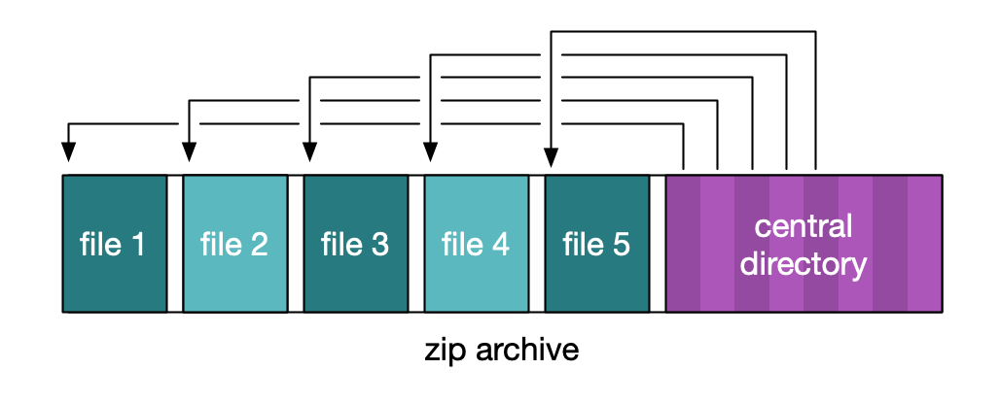

# Compressed vs uncompressed bags, and the choice of tar.gz

Bags are uploaded to the storage service as **compressed** archives, but stored as **uncompressed** files.

Why do we require users to upload compressed bags?

-   Because compressed bags can be passed around atomically.
    A user has either finished uploading a bag, or they haven't.
    You can't have a partial bag upload.

Why do we store bags as uncompressed files?

-   Our digitised bags are mostly made up of a small number of medium-sized images.
    (Typically a few hundred files per bag, each 5–10MB.)
    It's useful to be able to address these images individually, both programatically and for humans browsing our S3 buckets by hand.
-   It removes a layer of obfusaction in the file layout.
    You can list all the files to see what's in the storage service, rather than opening a bunch of archives.

Note that the storage service only uncompresses the first layer: if you upload a compressed bag that contains another compressed file, it won't uncompress the inner compressed file.

## Why do we use tar.gz?

We used zip archives in an early version of the storage service, but ultimately switched to tar.gz for two reasons:

-   A preference for a compression format that we could stream rather than saving to disk
-   Limits on the size of zip files we could handle

In more detail:

If you want to read a zip archive, you start by reading the central directory at the very end of the file.
This gives you a series of offsets for the individual entries in the archive.

This is easy if you can download the entire file to disk -- you can use `seek()` to jump around the file.
This is more complicated in S3 -- the Java `S3ObjectInputStream` you get when you read an object doesn't support seeking.
Additionally, the Java zipfile implementations we looked at all assumed a file on disk.

It's possible to read a zip file directly from S3 [using ranged GET requests](https://alexwlchan.net/2019/02/working-with-large-s3-objects/), but it's quite complicated.

We did try downloading zip files to an EBS volume and uncompressing from there, but that imposes size limits: you can only store a bag as big as that EBS volume.
You could provision a very large EBS volume to avoid hitting that limit, but that's inefficient, and bigger EBS volumes are more expensive.

These two issues led us to look at tar.gz.

If you want to read a tar.gz archive, you start reading from the beginning of the file.
Each entry is prepended by a header with some information about the name and size of that entry.

This is much easier to read from S3 -- you start reading bytes and keep going until you've read all of them.
We don't need to provision any EBS storage, and we can read an arbitrarily large bag with this approach.

It was simpler to update our workflow tools to send tar.gz archives than get zip unpacking working, so that's what we did.

Uploading zip files as the initial bag is currently unsupported.
