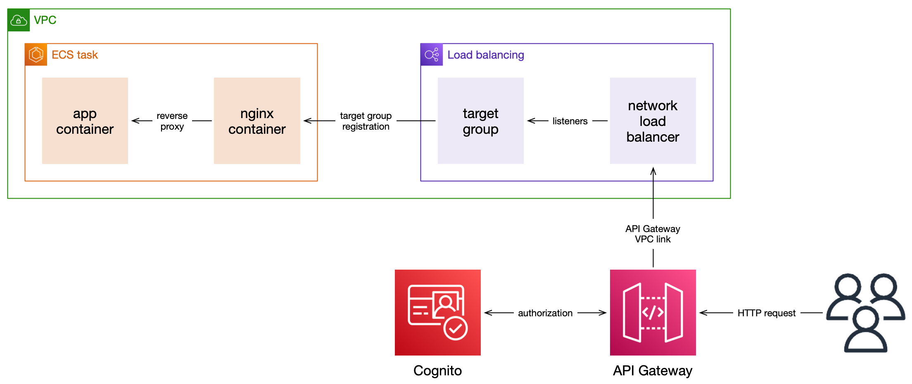

# How are requests routed to containers?

This document explains how requests are routed from a publicly visible HTTP endpoint to our app containers.

1.  A user makes an HTTP request, e.g. GET /ingests.

    This request is sent to API Gateway, either:

    -   Through the [API's Invoke URL](https://docs.aws.amazon.com/apigateway/latest/developerguide/how-to-call-api.html) (e.g. `https://ykxcqkp840.execute-api.eu-west-1.amazonaws.com/v1`), or
    -   Through a [custom domain name](https://docs.aws.amazon.com/apigateway/latest/developerguide/how-to-custom-domains.html) attached to the API

2.  API Gateway authorizes the request with Cognito.

    We typically use OAuth2 with the [client credentials flow](https://auth0.com/docs/flows/client-credentials-flow).
    If Cognito rejects the user's credentials, API Gateway returns an error response.

3.  If the user is authorized, API Gateway forwards the request to a network load balancer (NLB).

    This NLB is running inside a private VPC, which isn't accessible from the Internet.
    API Gateway uses a [VPC Link](https://docs.aws.amazon.com/apigateway/latest/developerguide/http-api-vpc-links.html) to connect to the NLB.

    API Gateway uses two different ports to distinguish between the APIs.

    -   If the request is for the bags API, it forwards the request to port 65534.
    -   If the request is for the ingests API, it forwards the request to port 65535.

4.  The NLB looks at the request, and applies two listener rules:

    -   If this request is on port 65534 (bags API), forward it to the bags target group
    -   If this request is on port 65535 (ingests API), forward it to the items target group

5.  The [target group](https://docs.aws.amazon.com/elasticloadbalancing/latest/application/load-balancer-target-groups.html) routes the request to one of the registered targets.

    In this case, the targets are ECS tasks running either the bags API or the ingests API.
    When the task starts, it tries to register with the target group.
    The target group runs some health checks to ensure the task can process requests before it becomes "registered" and is used to serve requests.

    If there are multiple tasks running, the target group distributes requests between them.

    Requests are routed to an externally published port on the ECS task; in this case, port 9000.

6.  Within the ECS task, we run two containers:

    -   The app container (e.g. `bags_api`, `ingests_api`)
    -   An nginx container

    Requests from the target group are initially routed to the nginx container, and then passed to the app container.
    The separate nginx container lets us apply some HTTP-specific config that's shared among all our apps (e.g. CORS).

    The nginx container runs on port 9000; the app container runs on port 9001.
    Only port 9000 is externally accessible.
