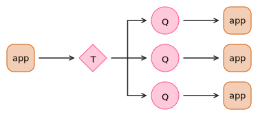
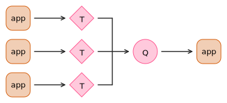

# Inter-app messaging with SQS and SNS

Most of our services form a pipeline: an app receives a message, does some work, then sends another message to the next app in line.
This continues until the work is finished (in this case, a bag has been successfully stored).

This document explains the details of how our inter-app messaging works.

## SQS queues and SNS topics

To receive a message, an app polls an *SQS queue*. (SQS = Simple Queuing Service)

To send a message, an app sends a notification to an *SNS topic*. (SNS = Simple Notification Service)

SQS queues can *subscribe* to an SNS topic, which means every notification sent to the topic is forwarded to the queue -- and in turn, can be received by an app.

At this point, you may ask: why don't apps send directly to queues?
Because we don't always have a one-to-one relationship between topics and queues.

Sometimes, we want a notification from one app to be distributed to multiple apps.
Multiple queues can subscribe to the same topic:

For example, after the bag versioner has assigned a version to a bag, it sends a notification to every replicator at once.
This allows replications to occur in parallel, rather than in serial.

This also allows a single app to process notifications from multiple apps.
A single queue can subscribe to multiple topics:

For example, all the replicators send messages to the same replica aggregator.
The aggregator counts the messages in to see if all the replicators have completed.

## Autoscaling based on queue size

Most of the time, the queues are empty and there's nothing for the apps to do.
To save money, we can use autoscaling: by default, we aren't running any of our pipeline workers, and we only turn them on when there are messages that need processing.

Specifically, we set up CloudWatch Alarms that monitor the size of each queue:

-   If a queue has messages waiting to be handled, start an instance of the app that reads from that queue
-   If a queue has no messages waiting and no messages in-flight, turn off any running instances of the app

This makes the storage service more cost-efficient, but it means bags can take longer to process than if it was always-on.
In our experience, this is a worthwhile tradeoff.

We don't autoscale apps that need to be continuously available -- i.e., the external APIs.
