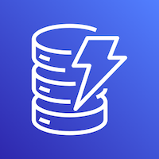
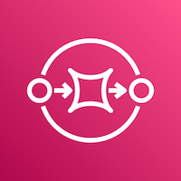
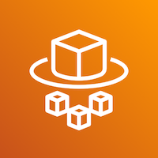
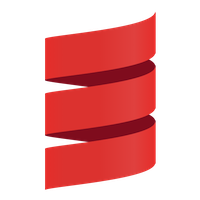
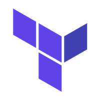
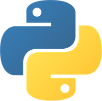

# Technologies

This document provides a brief overview of some of the key technologies we use in the storage service.

## AWS services

<table>
  <tr>
    <td>
      
    </td>
    <td>
      <strong>S3</strong> – petabyte-scale object storage.
      We use it for permanent storage of assets, temporary/working storage, and to hold storage "manifests" (our JSON representation of a bag).
    </td>
  </tr>
  <tr>
    <td>
      
    </td>
    <td>
      <strong>DynamoDB</strong> – a NoSQL database that we use as a key-value store.
      We use it to track ingests, store information about versions, and lock around certain processes.
    </td>
  </tr>
  <tr>
    <td>
      
      
    </td>
    <td>
      <strong>SNS/SQS</strong> – inter-app message queues.
      Our apps form a pipeline: an app receives a message, does some work, then sends another message to the next app in line.
      This inter-app messaging uses SNS and SQS, for more see <a href="./inter-app-messaging.md">inter-app messaging</a>.
    </td>
  </tr>
  <tr>
    <td>
      
    </td>
    <td>
      <strong>ECS/Fargate</strong> – a serverless container runtime.
      We package our services in Docker images, and then Fargate actually runs the containers, without us having to provision VMs/servers to run them on.
      Fargate is a subservice of Elastic Container Service, or ECS.
    </td>
  </tr>
</table>

## Tools

<table>
  <tr>
    <td>
      
    </td>
    <td>
      <strong>Scala</strong> – a JVM-based language with an emphasis on functional programming.
      Most of the storage service applications are written in Scala.
    </td>
  </tr>
  <tr>
    <td>
      
    </td>
    <td>
      <strong>Terraform</strong> – an infrastructure-as-code tool that we use to manage our resources: AWS services, Elastic Cloud clusters, Azure storage containers, and so on.
      Using Terraform makes it easier for us to track changes to our infrastructure, and to run multiple identical copies of the storage service (one for real content, one for testing).
    </td>
  </tr>
  <tr>
    <td>
      
    </td>
    <td>
      <strong>Python</strong> – a scripting language that we use as "glue" code between certain applications, and for local debugging scripts.
    </td>
  </tr>
</table>
