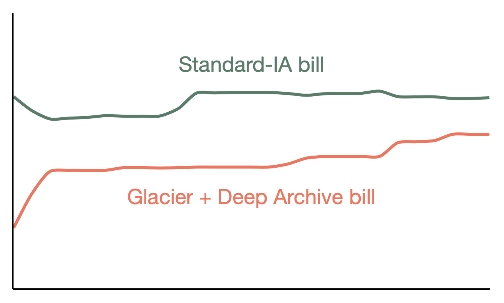

# Small fluctuations in our storage bill

The storage service runs in a dedicated AWS account, so the account bill only reflects the cost of the storage service.

The dominant cost in this account is the Standard-IA bill, but at a glance it can look a little disconcerting. In particular, our Standard-IA bill goes down as well as up – but why would it ever go down? Why would we ever remove objects in Standard-IA? Should we be concerned about the integrity of the storage service?

No – slight fluctuations in the Standard-IA bill are a normal part of storage service operations.

<figure>
  
  <figcaption>
    The shape of our storage bill in April 2023. Not drawn to scale; drawn to illustrate the general shape.
  </figcaption>
</figure>

Why?

*   When objects in the warm replica [transition to Glacier](https://app.gitbook.com/o/-LumfFcEMKx4gYXKAZTQ/s/5fJiiTl4PgHkFAzFiHc8/~/changes/1/wellcome-specific-information/our-storage-configuration/using-multiple-storage-tiers-for-cost-efficiency-a-v-tiffs), they get removed from Standard-IA. That cost moves from Standard-IA to Glacier.
*   When objects in the cold replica [transition to Glacier Deep Archive](https://app.gitbook.com/o/-LumfFcEMKx4gYXKAZTQ/s/5fJiiTl4PgHkFAzFiHc8/~/changes/1/wellcome-specific-information/our-storage-configuration/replica-configuration), they get removed from Standard-IA. That cost moves from Standard-IA to GDA.

In the graph above, you can see a drop in the Standard-IA bill at the beginning of the month – but it's accompanied by a rise in the Glacier/Deep Archive bill. A bunch of objects just got transitioned into a cheaper storage class.

A substantial drop in the Standard-IA bill may be a red flag, but small fluctuations aren't a cause for concern.
