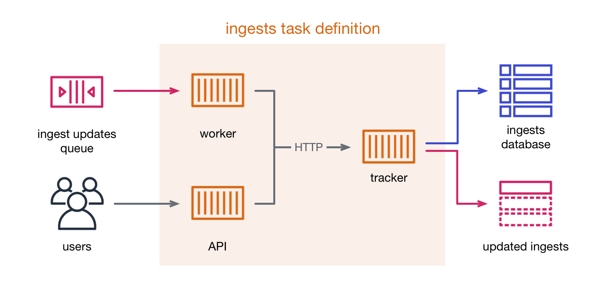

# ingests

These three apps are responsible for tracking the state of ingests in the pipeline.



*   The **ingest tracker** is the only app that can talk directly to the ingests database.

    It presents an internal HTTP API that other apps can use to query or update the ingests database.

    Whenever it updates an ingest, it sends a copy of the ingest to an SNS topic.

*   Pipeline applications send *ingest updates* to an SQS queue.
    These describe a small change to the state of an ingest; for example a single event:

    ```json
    {
      "id": "49aa2448-e521-4c66-9111-5bd3d7f1f999",
      "event": "Unpacking started"
    }
    ```

    The **ingest worker** reads updates from the queue, and makes a PATCH request with the update to the ingest tracker using its HTTP API.
    The tracker updates the database, and the worker deletes the queue message.

*   Users can create or retrieve ingests using the **ingests API**.
    The API application forwards to the tracker app, which does the appropriate database operations.

We deploy the three apps together, because they have a shared dependency on the ingest tracker's internal API.
