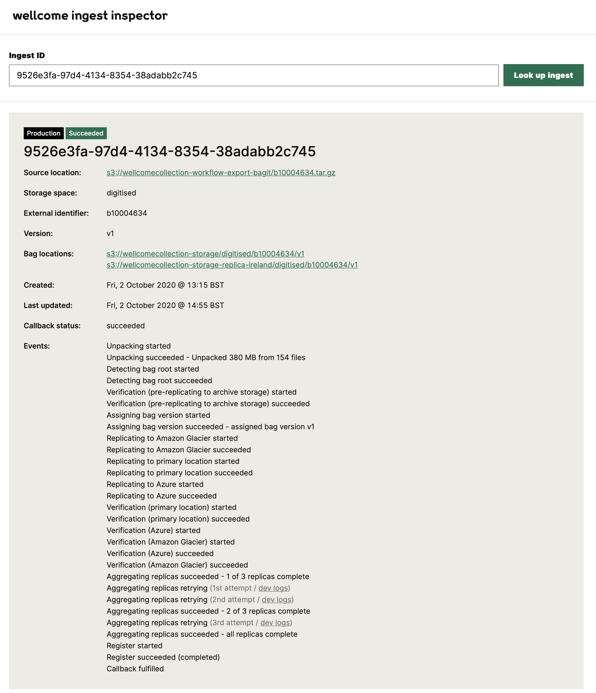
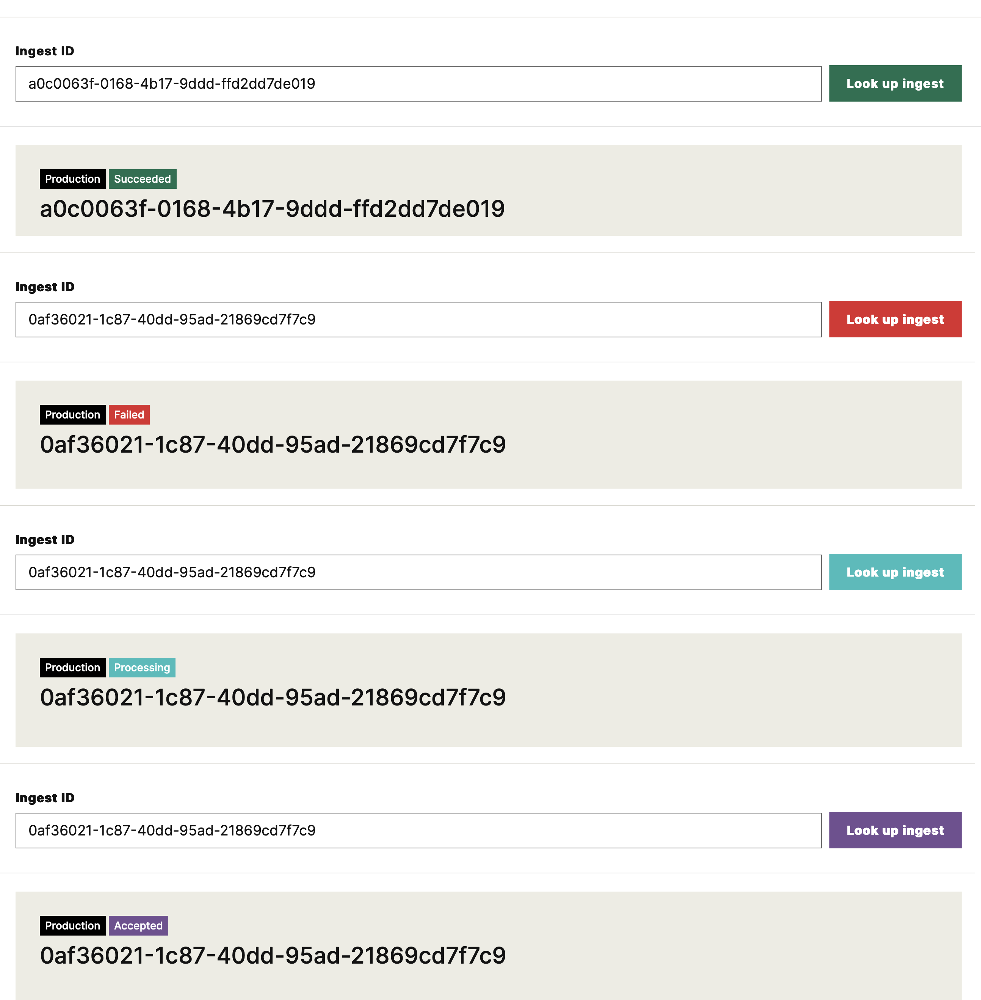
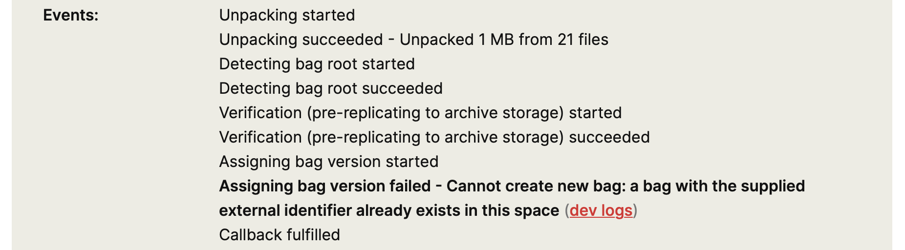
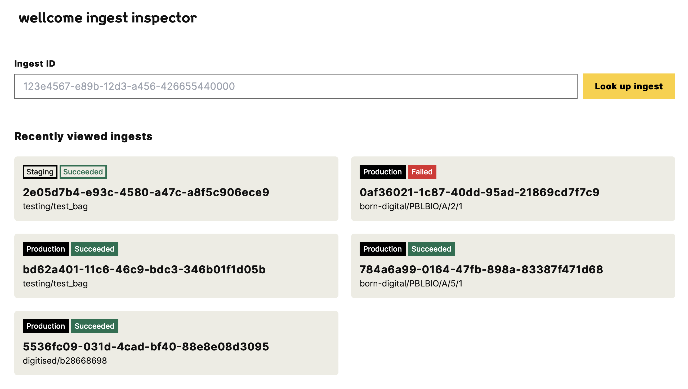
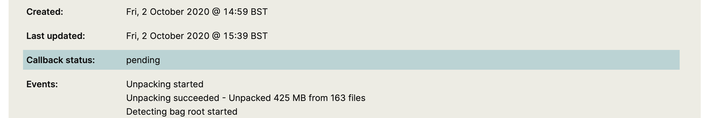

# Wellcome Ingest Inspector

With the ingest inspector, users can track the progress of ingests in the [Wellcome storage service](https://github.com/wellcomecollection/storage-service).

Saving a new package to the storage service is a multi-step process called an **ingest**.
When you ask the service to store a new package, you get an **ingest ID**.
You can use the ingest ID to track the progress of your package -- see whether it's been successfully stored, or how far through the process it is.



-   [Motivation](#motivation)
-   [Features](#features)
-   [Usage](#usage)
-   [Development](#development)

## Motivation

The storage service has a JSON API which is protected by OAuth.
Providing read-only access to the ingests data in a web app is easier than doing OAuth negotiation yourself.

The ingests data isn't sensitive, so we don't need authentication in front of it.
It mostly contains user-facing messages from the storage service, or an identifier used by one of Wellcome's catalogue databases.
The user-facing messages can be seen in the publicly-available source code, and the identifiers don't encode any sensitive information.


## Features

The app has a number of features designed to make it as easy as possible for somebody to get the data they need.

*   **It doesn't ask you to choose between prod and staging API.**

    We run two separate instances of the storage service: production ("prod") and staging.
    They both use UUIDs for ingest IDs, so a given ingest ID should refer to a unique ingest across the two services.

    Rather than asking users to specify whether they want to query the prod or staging APIs, the app queries *both* APIs and returns the appropriate ingest.

    The app has a different visual appearance, depending on whether an ingest is from the prod or staging API:

    ![Two ingests. One says "Found ingest [ID] in the production API", the other "Found ingest [ID] in the staging API". The prod API has a solid green background; the staging API has green text on a white background.](screenshots/prod_staging_api.png)

*   **It uses colours to distinguish the state of an ingest.**

    An ingest can be in one of four states: *accepted*, *processing*, *succeeded* or *failed*.

    The app changes its tint colour to reflect the state of an ingest, so you get an instant visual indication before you start reading the text:

    

*   **It displays timestamps with limited precision.**

    The storage service records timestamps with millisecond precision.
    This is useful for debugging, but is usually too much detail for humans.
    The app only ever displays HH:MM precision, for example:

    > Tue, 21 July 2020 @ 13:27

    The original timestamp is in the `title` attribute, so you can find it by hovering -- but I'm not sure anyone has ever used this.

*   **It displays localised times, rather than UTC.**

    The storage service records timestamps in UTC, the one true timezone.
    This is useful for coordinating across different machines, but less readable for humans.

    For example, the UK runs an hour ahead of UTC during the summer.
    If you look at the UTC timestamps, it can seem like the last event was an hour ago.

    The app detects your browser locale, and adjusts the timezone to match, for example:

    > Wed, 30 September 2020 @ 16:18 BST

    It includes the timezone to remind you that this is a localised time.
    The original timestamp in the `title` attribute is the UTC timestamp returned by the storage service.

*   **It includes hints to tell you if a timestamp is recent.**

    A common question is: *has this ingest still being processed, or has it got stuck?*

    The app highlights the most recent event, and includes some hints in the timestamp to tell you if it was recent:

    > today @ 10:21 BST (just now)<br/>
    > today @ 10:20 BST (30 seconds ago)<br/>
    > today @ 10:16 BST (5 minutes ago)<br/>
    > yesterday @ 9:21 BST

    This means the user doesn't need to know the exact date and time to know if an ingest was updated recently.

    (You can read about how this works in [Showing human-friendly dates in JavaScript](https://alexwlchan.net/2020/05/human-friendly-dates-in-javascript/).)

*   **It links to relevant objects/prefixes in the S3 console.**

    The storage service works with objects in S3: that's where you upload a package you want it to store, and that's where it stores two of the three replicas of every package.
    The app includes links to the original object you uploaded, and where it's stored the S3 copies, so you can jump straight to them.

    This is useful if, say, the storage service can't find the package you've uploaded.
    You can use the link to jump straight to the object.

    (The Azure Blob Storage portal doesn't allow linking directly to a prefix, or there'd be a link to the Azure replica as well.)

*   **It highlights failed ingest events, and links to relevant logs.**

    An ingest can have many events -- in some cases over 50 -- but they follow a predictable pattern.
    This means the app can highlight failures, making them easier to pick out:

    

    It can also recognise which app sent a given failure event.
    The "dev logs" link goes to a pre-filled query in our logging service, which filters for the right app and approximate time when this event was sent, making it easy to debug.

*   **It remembers what ingests you looked at recently.**

    Often you'll want to look up the same ingest multiple times in quick succession, to track its progress through the day.

    To save you looking up the ingest ID each time, the app remembers the last ten ingests you looked that, and presents a list of them on the front page:

    

    (More specifically, it remembers the last ten ingests looked up by a given browser.)

*   **It highlights pending callbacks.**

    An ingest is marked as "succeeded" when there are three, verified copies of the original package in the long-term storage, and the package has been registered.

    Once it succeeds (or fails), the storage service can optionally make a callback to tell another service that it's done.
    For example, our digitised workflow system waits for a callback rather than polling the ingests API repeatedly.

    If an ingest has succeeded, but the storage service has a pending callback, this gets a visual highlight:

    


## Usage

You can use the app by visiting <https://d1dti1kbjcy26.cloudfront.net>.

## Development
### Backend

The backend consists of a single Lambda function, which fetches ingests from the Wellcome Storage Service. To run the Lambda function code locally, navigate into the `ingest_inspector/backend_lambda` directory and run:

```shell
AWS_PROFILE=storage-developer python3 src/ingest_inspector_backend.py --ingest-id=<INGEST_ID>
```

### Frontend

To install dependencies and start the frontend development server, navigate into the `ingest_inspector/frontend` directory and run:

```shell
npm install
npm run dev
```

### Deployments

To upload a new version of the backend Lambda function into S3, run:

```shell
AWS_PROFILE=storage-developer python3 ./builds/publish_lambda_zip.py monitoring/ingest_inspector/backend_lambda --bucket=wellcomecollection-storage-infra --key=lambdas/monitoring/ingest_inspector_backend.zip
```

The frontend is hosted as a static website on S3 and served via CloudFront. To build and deploy the app, navigate into
the `ingest_inspector/frontend` directory and run:

```shell
sh deploy.sh
```

