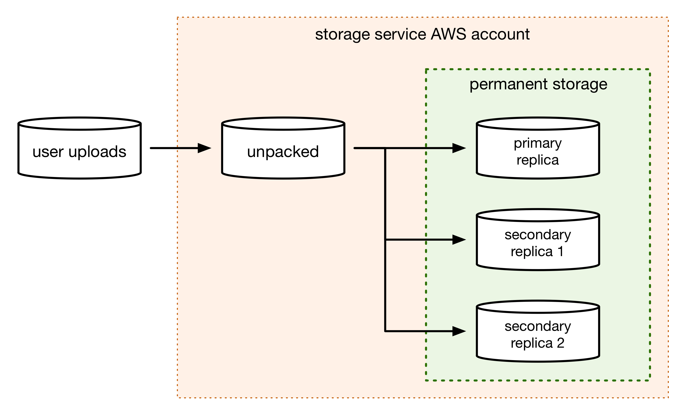

# replifier

The "replifier" (replicator–verifier) is responsible for:

*   Creating copies of our bags in permanent storage
*   Verifying that a bag is "correct" -- checksums match the files, no unreferenced files were included, fetch.txt URIs are consistent, and so on


## How data moves through the storage service



1.  The user uploads a bag to the **user uploads bucket**.

2.  The bag unpacker unpacks the user-uploaded bag into the **unpacked bags bucket**.

    We want it inside our AWS account as soon as possible (so it can't be deleted under our feet).

    We don't copy it to permanent storage yet (it hasn't been verified, and we don't want to taint the permanent storage with bags with bad checksums or data).

3.  The bag verifier does a **standalone verification** of the unpacked bag.

    This tells us whether the bag is valid, and safe to copy to permanent storage.

4.  If the bag passes verification, the **bag replicator** copies the bag from the unpacked bags bucket to the permanent storage.

    e.g. in the diagram above, it runs three replications:

    ```
    src -> unpacked, dst -> primary
    src -> unpacked, dst -> replica 1
    src -> unpacked, dst -> replica 2
    ```

5.  Once a bag has been replicated, the bag verifier does a **replicated bag verification** on each new replica.

    This re-checks that the bag is valid, and confirms that it's the same as the originally unpacked bag.

In theory, each of these buckets could be backed by a different storage provider.
In practice:

*   We only support user uploads from S3.
*   We unpack bags into a bucket in S3.
*   The replicas can be a mix of providers: currently we have one in S3, one in S3 Glacier, one in Azure.

At time of writing (July 2020), our codebase has hard-coded assumptions that the user uploads and unpacked bags buckets are both in S3.


## What is the "primary" bucket?

Throughout the bag replicator and verifier code, you may see references to *source* (`src`) and *destination* (`dst`) bag locations.
Hopefully these are self-explanatory in the context of the replicator/verifier.

You will also see references to the *primary* bucket, which is something different.
This is an aspect of how we handle versioning.

Throughout the storage service, we distinguish between *primary and secondary replicas*.

-   The primary (or *warm*) replica is meant for day-to-day use.
-   The secondary (or *cold*) replicas are byte-for-byte identical copies of the primary replica, but stored in cheap storage (e.g. Amazon Glacier).
    They are only meant to be used in a disaster recovery scenario.

The primary bucket is a constant of the storage service.


## How does versioning work?

The BagIt spec allows a bag to have "holes" by using [a fetch.txt file](https://tools.ietf.org/html/rfc8493#section-2.2.3).
The fetch.txt tells the user that files are not included in the bag, but may be loaded from a given URI.
It helps reduce bag sizes, but presents a preservation risk -- if the fetch.txt refers to an external resource, the integrity of the storage service depends on the integrity of this resource.
For this reason, we have strict rules about what is allowed in a fetch.txt, beyond merely "conforms to the BagIt spec".

We use the fetch.txt to implement **shallow updates**.
If somebody wants to update a bag, but only some of the files have changed, they can use a fetch.txt to tell the storage service "get these files from the previous version of the bag".

To keep the storage service self-contained and simple, we insist that all fetch.txt URIs are of the following from:

```
s3://wellcomecollection-storage/{space}/{externalIdentifier}/{version}/{path}
```

That is, all fetch.txt URIs:

*   Must be an S3 URI
*   Must refer to the primary bucket
*   Must refer to a previous version of the same bag (i.e. same space and externalIdentifier)

This means the primary replica is a fully self-contained copy of the storage service.

If you look at fetch.txt in the secondary replicas, do URI still refers to The primary bucket.
The secondary replicas are byte-for-byte identical copies of the primary replica, intended for disaster recovery rather than daily usage.
Modifying their fetch.txt would mean regenerating the tag manifests, which substantially increases the complexity and potential failure cases for the storage service.
